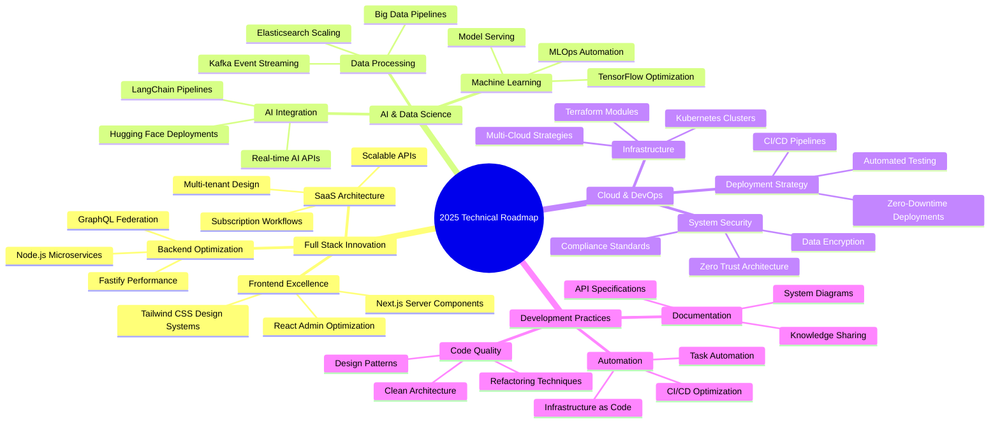
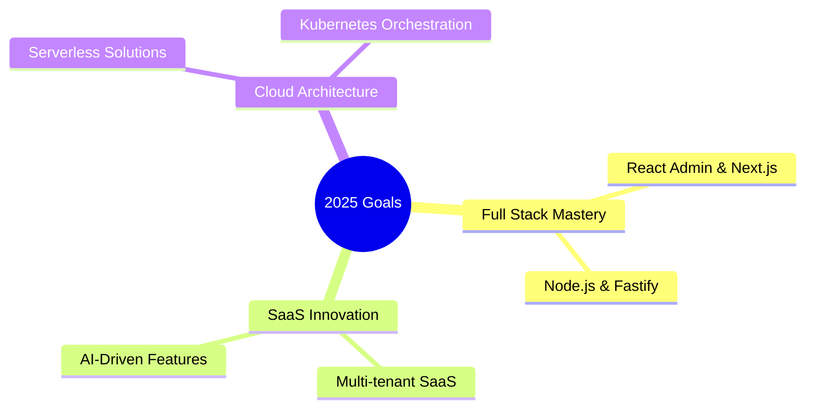

# < Hello World! /> 

<div align="center">


[](https://git.io/typing-svg)

[](https://git.io/typing-svg)

[](https://github.com/nexus-aissam)
[](https://paypal.me/aissamirhir)
[](https://profile.codersrank.io/user/nexus-aissam)

</div>

## 🧑‍💻 About Me

```typescript
class FullStackArchitect {
    name: string = "Aissam Irhir";
    title: string = "Senior Full Stack Developer & System Architect";
    location: string = "Morocco 🇲🇦";
    workingOn: string[] = [
        "AI-Integrated SaaS Platforms",
        "Real-time React UIs",
        "Scalable Node.js Microservices"
    ];
    skills: {
        frontend: string[];
        backend: string[];
        databases: string[];
        tools: string[];
        aiTechnologies: string[];
    } = {
        frontend: ["React", "React Admin", "TypeScript", "Next.js", "Tailwind CSS"],
        backend: ["Node.js", "Express.js", "NestJS", "Fastify", "Socket.io"],
        databases: ["MongoDB", "PostgreSQL", "Redis", "Elasticsearch"],
        tools: ["Docker", "Kubernetes", "GitLab CI", "Nginx", "Terraform"],
        aiTechnologies: ["TensorFlow", "LangChain", "Hugging Face"]
    };
    funFact: string = "I build UIs and APIs faster than my coffee brews! ☕";
}
```

## 🎯 Professional Expertise

| Domain | Technologies & Skills |
|--------|---------------------|
| **Frontend Development** | `React` • `React Admin` • `Next.js` • `TypeScript` • `Tailwind CSS` • `Material-UI` |
| **Backend Development** | `Node.js` • `Express.js` • `NestJS` • `Fastify` • `TypeScript` • `RESTful APIs` • `GraphQL` |
| **SaaS Development** | `Multi-tenant Architectures` • `Subscription Models` • `API-Driven Platforms` • `Scalable Workflows` |
| **Real-time Systems** | `Socket.io` • `WebSockets` • `Event-Driven Architecture` • `Kafka` |
| **Database & Caching** | `MongoDB` • `Mongoose` • `PostgreSQL` • `Redis` • `Elasticsearch` • `Data Modeling` |
| **DevOps & CI/CD** | `Docker` • `Kubernetes` • `GitLab CI` • `Nginx` • `Linux` • `Terraform` |
| **AI Integration** | `TensorFlow` • `LangChain` • `Hugging Face` • `AI-Driven APIs` |
| **Development Practices** | `Clean Code` • `TDD` • `Code Review` • `API Documentation` • `Agile` • `Design Systems` |

## 📊 This Week's Development Breakdown

```text
🔨 Coding Time              40 hrs 25 mins
├─ TypeScript               18 hrs 50 mins  ████████████▌░░░░░░░  46.6%
├─ JavaScript               10 hrs 15 mins  ███████▌░░░░░░░░░░░░  25.4%
├─ React                    7 hrs 20 mins   █████▌░░░░░░░░░░░░░░  18.1%
└─ MongoDB                  4 hrs 00 mins   ███▌░░░░░░░░░░░░░░░░   9.9%

📚 Project Analysis         24 hrs 10 mins
├─ System Architecture       9 hrs 00 mins  █████████▌░░░░░░░░░░  37.2%
├─ AI Integration            7 hrs 15 mins  ███████▌░░░░░░░░░░░░  30.0%
├─ UI/UX Design             4 hrs 45 mins  ████▌░░░░░░░░░░░░░░░  19.7%
└─ Technical Documentation  3 hrs 10 mins  ███▌░░░░░░░░░░░░░░░░  13.1%
```

## 🛠️ Tech Stack & Tools

<div align="center">

### Frontend Stack


### Backend Stack


### Database & Cache


### DevOps & Tools


### AI & Machine Learning


### Cloud & Process Management


</div>

## 📈 Performance & Achievement Highlights

<table>
  <tr>
    <td><b>🚀 SaaS Scaling</b></td>
    <td>Scaled multi-tenant SaaS platforms</td>
  </tr>
  <tr>
    <td><b>⚡ Full Stack Performance</b></td>
    <td>Optimized React UIs and Node.js APIs for 60% faster response times</td>
  </tr>
  <tr>
    <td><b>🛡️ Reliability</b></td>
    <td>Achieved 99.99% uptime with Kubernetes and automated failover</td>
  </tr>
  <tr>
    <td><b>📊 AI & Data Processing</b></td>
    <td>Processed 15M+ daily events with AI-driven workflows</td>
  </tr>
</table>

## 🎯 Current Learning Path



## 📈 Performance Achievements

- 🚀 **SaaS Scalability**: Scaled multi-tenant SaaS platforms to handle **1M+ concurrent users**.
- ⚡ **Full Stack Performance**: Achieved **60% faster response times** with optimized React UIs and Node.js APIs.
- 🛡️ **System Reliability**: Maintained **99.99% uptime** using Kubernetes and automated failover.
- 📊 **AI & Data Processing**: Processed **15M+ daily events** with AI-driven pipelines and real-time workflows.

## 🌱 Current Focus



## 🌐 Let's Connect & Collaborate

<div align="center">

### 💼 Professional
[](https://linkedin.com/in/aissam-irhir)
[](https://stackoverflow.com/users/29435847)
[](https://codepen.io/aissam-the-animator)

### 🌟 Social Networks
[](https://facebook.com/issamirhir)
[](https://instagram.com/aissam_ir)
[](https://x.com/Nexus_az1)
[](https://bsky.app/profile/aissamnexus.bsky.social)

### 📱 Quick Links
[](https://aissamirhir.com)
[](mailto:aissamirhir@gmail.com)

### 💻 Developer Profiles
[](https://github.com/nexus-aissam)
[](https://www.npmjs.com/~nexus-aissam)

</div>

### 📊 Social Stats
<div align="center">


[](https://stackoverflow.com/users/29435847)

</div>

## 💝 Support & Sponsorship

<div align="center">

[](https://github.com/sponsors/nexus-aissam)
[](https://buymeacoffee.com/aissam.nexus)
[](https://paypal.me/aissamirhir)

### 🏆 Sponsor Benefits
- 💡 Priority consultation for full stack & SaaS solutions
- 🔧 Custom React and Node.js development
- 📚 Exclusive tutorials on SaaS architecture & AI integration

### 💭 Daily Inspiration


</div>


<div align="center">

*"Every line of code weaves a story of innovation and impact."*

</div>
