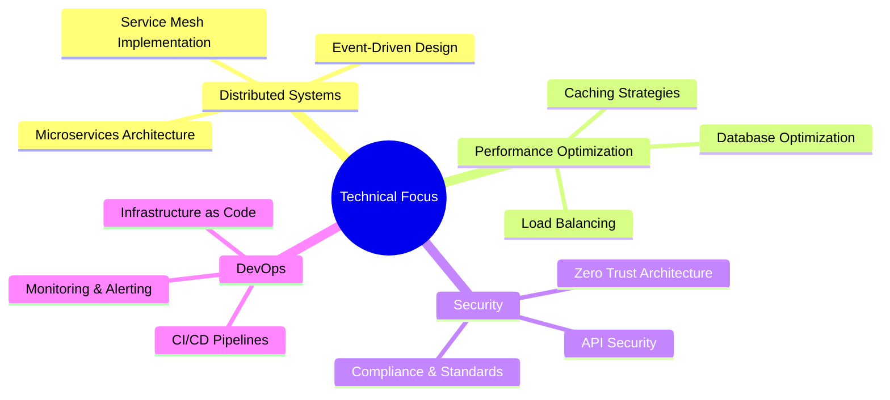

# 👋 Welcome to My Digital Workshop

<div align="center">
  
[](https://git.io/typing-svg)

[](https://wakatime.com/@018c253c-322a-49c1-96c3-988ea80be6b8)

[](https://github.com/nexus-aissam)

</div>

## 🎭 The Developer Behind the Code

```typescript
const aissam = {
    role: "Senior Backend Developer",
    experience: "3+ years",
    location: "Morocco 🇲🇦",
    workingOn: "Enterprise-scale SaaS Applications",
    specialization: "Real-time Systems & Distributed Architecture",
    passions: ["Clean Code", "System Architecture", "Performance Optimization"],
    motto: "Code that scales, systems that last"
};
```

## 🌟 Professional Highlights

<table>
  <tr>
    <td>
      
    </td>
    <td>
      
    </td>
  </tr>
</table>

### 🏆 Key Achievements
- 🚀 Scaled systems to handle **100K+ concurrent users**
- ⚡ Achieved **40% performance boost** in API response times
- 🎯 Maintained **99.9% uptime** for critical systems
- 🛡️ Implemented **zero-downtime** deployment strategies
- 📊 Processed **10M+ daily events** in real-time systems

## 💻 Technical Mastery

<div align="center">

### 🔧 Core Technologies


### 🗄️ Data Management


### ☁️ Cloud & DevOps


</div>

## 📊 Weekly Development Breakdown

<!--START_SECTION:waka-->
```text
TypeScript   16 hrs 42 mins  ████████████░░░░░░░░  48.3%
JavaScript   12 hrs 18 mins  ██████████░░░░░░░░░░  35.6%
JSON         2 hrs 45 mins   ███░░░░░░░░░░░░░░░░░   8.0%
Docker       1 hr 22 mins    ██░░░░░░░░░░░░░░░░░░   4.0%
Other        1 hr 25 mins    ██░░░░░░░░░░░░░░░░░░   4.1%
```
<!--END_SECTION:waka-->

## 🎯 Current Projects & Focus



## 🌐 Professional Network

<div align="center">
  
[](https://linkedin.com/in/aissam-irhir)
[](https://stackoverflow.com/users/29435847)
[](https://x.com/Nexus_az1)
[](https://bsky.app/profile/aissamnexus.bsky.social)

</div>

## 📈 Contribution Overview

<div align="center">
  
</div>

### 📊 Repository Analytics


## 💡 Featured Projects

<div align="center">

[](https://github.com/nexus-aissam/real-time-chat)
[](https://github.com/nexus-aissam/task-scheduler)

</div>

## 🎮 Let's Connect Through Code

<div align="center">

[](https://github.com/nexus-aissam)

</div>

## 💰 Support My Open Source Work

<div align="center">
  
[](https://buymeacoffee.com/aissam.nexus)
[](https://paypal.me/ighirissam100@gmail.com)

</div>

---

<div align="center">
  
### 💭 Random Dev Quote


### 📝 Latest Blog Posts
<!-- BLOG-POST-LIST:START -->
- [Optimizing Node.js Applications for Scale](https://dev.to/nexus-aissam)
- [Building Resilient Microservices with Node.js](https://dev.to/nexus-aissam)
- [Real-time Systems: Best Practices and Pitfalls](https://dev.to/nexus-aissam)
<!-- BLOG-POST-LIST:END -->

</div>

<div align="center">
  
*"Code is like humor. When you have to explain it, it's bad." – Cory House*

</div>

<!-- Made with 💻 and ❤️ by Aissam Irhir -->
