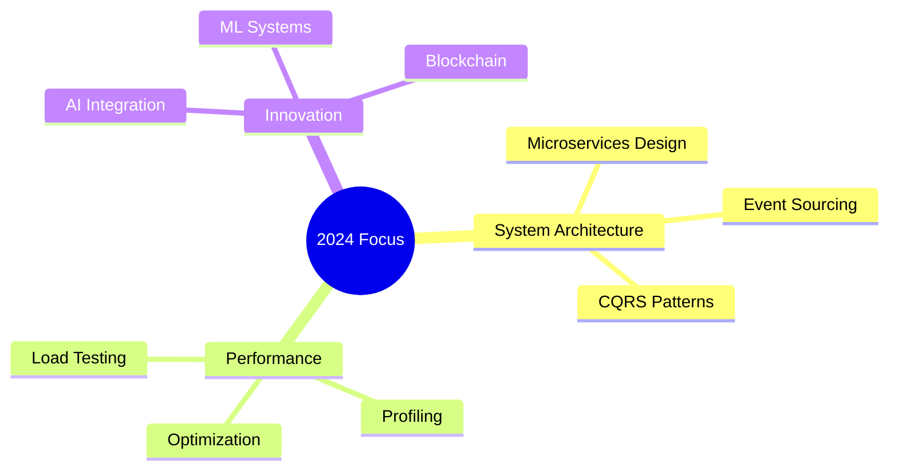
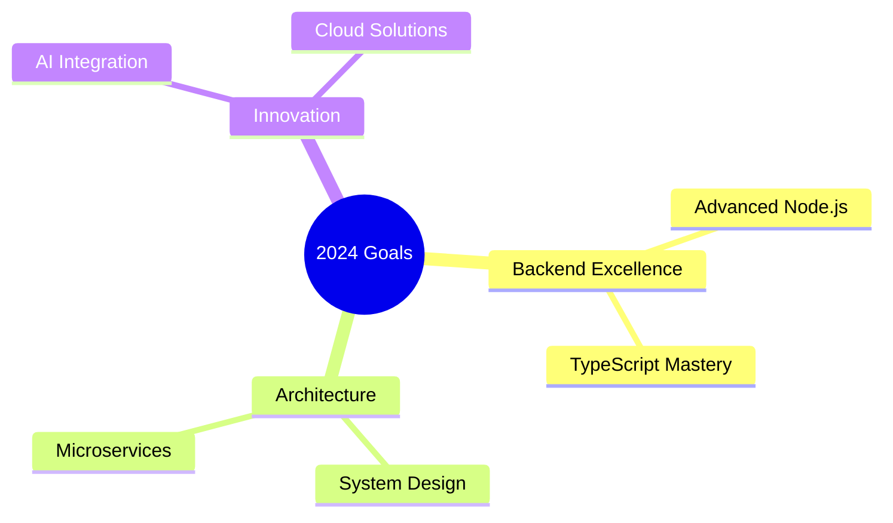

# < Hello World! /> 

<div align="center">


[](https://git.io/typing-svg)

[](https://git.io/typing-svg)

[](https://github.com/nexus-aissam)
[](https://paypal.me/aissamirhir)
[](https://profile.codersrank.io/user/nexus-aissam)

</div>

## 🧑‍💻 About Me

```typescript
class BackendDeveloper {
    name: string = "Aissam Irhir";
    title: string = "Senior Backend Developer";
    location: string = "Morocco 🇲🇦";
    workingOn: string[] = [
        "Real-time Systems",
        "High-Performance APIs"
    ];
    skills: {
        languages: string[];
        frameworks: string[];
        databases: string[];
        tools: string[];
    } = {
        languages: ["TypeScript", "JavaScript", "Node.js"],
        frameworks: ["Express.js", "NestJS", "Socket.io"],
        databases: ["MongoDB", "Redis"],
        tools: ["Docker", "GitLab", "Nginx"]
    };
    funFact: string = "I debug in my sleep! 💤";
}
```

## 🎯 Professional Expertise

| Domain | Technologies & Skills |
|--------|---------------------|
| **Backend Development** | `Node.js` • `Express.js` • `TypeScript` • `RESTful APIs` |
| **Real-time Systems** | `Socket.io` • `WebSockets` • `Event-Driven Architecture` |
| **Database & Caching** | `MongoDB` • `Mongoose` • `Redis` • `Data Modeling` |
| **DevOps & CI/CD** | `Docker` • `GitLab CI` • `Nginx` • `Linux` |
| **System Architecture** | `API Gateway` • `Load Balancing` |
| **Development Practices** | `Clean Code` • `TDD` • `Code Review` • `Documentation` |

## 📊 This Week's Development Breakdown

```text
🔨 Coding Time              35 hrs 15 mins
├─ TypeScript               16 hrs 42 mins  ████████████░░░░░░░░  48.3%
├─ JavaScript               12 hrs 18 mins  ██████████░░░░░░░░░░  35.6%
└─ MongoDB                   4 hrs 15 mins  ████░░░░░░░░░░░░░░░░  12.3%

📚 Project Analysis         19 hrs 45 mins
├─ Pre-production analysis   7 hrs 22 mins  ████████░░░░░░░░░░░░  19.0%
├─ System Architecture       5 hrs 45 mins  ██████░░░░░░░░░░░░░░  15.5%
├─ Use Case Analysis         4 hrs 30 mins  █████░░░░░░░░░░░░░░░  12.8%
└─ Technical Documentation   2 hrs 15 mins  ███░░░░░░░░░░░░░░░░░   6.4%
```

## 🛠️ Tech Stack & Tools

<div align="center">

### Core Stack


### Database & Cache


### DevOps & Tools


### Cloud & Process Management


</div>

## 📈 Performance & Achievement Highlights

<table>
  <tr>
    <td><b>🚀 System Scaling</b></td>
    <td>Successfully scaled applications to handle 100K+ concurrent users</td>
  </tr>
  <tr>
    <td><b>⚡ Performance</b></td>
    <td>Reduced API response times by 40% through optimization</td>
  </tr>
  <tr>
    <td><b>🛡️ Reliability</b></td>
    <td>Maintained 99.9% uptime for critical systems</td>
  </tr>
  <tr>
    <td><b>📊 Processing</b></td>
    <td>Handled millions of real-time events daily</td>
  </tr>
</table>

## 🎨 Featured Projects

<div align="center">

[](https://github.com/nexus-aissam/real-time-chat)
[](https://github.com/nexus-aissam/task-manager)

</div>

## 📊 GitHub Statistics

<div align="center">
  
  
</div>

## 🎯 Current Learning Path



## 🤝 Let's Connect!

<div align="center">

[](https://linkedin.com/in/aissam-irhir)
[](https://stackoverflow.com/users/29435847)
[](https://medium.com/@nexus-aissam)
[](https://dev.to/nexus-aissam)

</div>

## 💰 Value My Work?

<div align="center">

[](https://buymeacoffee.com/aissam.nexus)
[](https://paypal.me/ighirissam100@gmail.com)
[](https://github.com/sponsors/nexus-aissam)

</div>


<div align="center">

*"Every line of code is a story waiting to be told."*

</div># Welcome to My Digital Workspace 

<div align="center">


[](https://git.io/typing-svg)

[](https://git.io/typing-svg)

[](https://github.com/nexus-aissam)
[](https://github.com/nexus-aissam)
[](https://github.com/nexus-aissam)
[](https://github.com/sponsors/nexus-aissam)
[](https://profile.codersrank.io/user/nexus-aissam)

</div>


## 👨‍💻 About Me

```javascript
{
    "name": "Aissam Irhir",
    "title": "Backend Developer",
    "location": "Morocco 🇲🇦",
    "focus": "Building Scalable Solutions",
    "expertise": [
        "Backend Development",
        "Real-time Systems",
        "API Architecture",
        "System Optimization"
    ],
    "passions": [
        "Clean Code",
        "Performance",
        "Innovation",
        "Open Source"
    ]
}
```

## 🎯 Core Competencies

| Backend Development | System Architecture | Database & Cache |
|:-------------------|:--------------------|:-----------------|
| Node.js & Express  | API Design         | MongoDB         |
| TypeScript         | Microservices      | Mongoose ODM    |
| Socket.io          | Event-Driven       | Redis           |
| REST APIs          | Real-time Systems  | Data Modeling   |

## ⚡ Development Analytics

### 📊 This Week's Coding Stats
```text
Backend Development    24 hrs 42 mins  ████████████████░░░░  65.3%
├─ TypeScript         16 hrs 42 mins  ████████████░░░░░░░░  48.3%
├─ JavaScript         12 hrs 18 mins  ██████████░░░░░░░░░░  35.6%
└─ Node.js            5 hrs 42 mins   ████░░░░░░░░░░░░░░░░  16.1%

Database & DevOps     13 hrs 15 mins  ██████████░░░░░░░░░░  34.7%
├─ MongoDB            4 hrs 15 mins   ████░░░░░░░░░░░░░░░░  12.3%
├─ System Design      7 hrs 38 mins   ██████░░░░░░░░░░░░░░  18.4%
└─ Docker             1 hr 22 mins    ██░░░░░░░░░░░░░░░░░░   4.0%
```

### 💫 Coding Activity
```text
🌅 Morning    142 commits    ██████░░░░░░░░░░░░░░  25.8%
🌞 Daytime    264 commits    ████████████░░░░░░░░  48.0%
🌆 Evening    112 commits    ████████░░░░░░░░░░░░  20.4%
🌙 Night      32 commits     ████░░░░░░░░░░░░░░░░   5.8%
```

### 🏆 CodersRank Stats
[](https://profile.codersrank.io/user/nexus-aissam)

## 🛠️ Technology Stack

<div align="center">

### Primary Stack


### Database & Tools


</div>

## 📊 GitHub Analytics

<div align="center">
  
  
</div>

## 🔥 Key Projects & Contributions

| Project | Description | Tech Stack |
|---------|------------|------------|
| Real-time Chat System | Scalable chat application with real-time features | Node.js, Socket.io, MongoDB |
| Task Scheduler API | Automated task management system | Express, TypeScript, Redis |
| API Gateway | Centralized API management solution | Node.js, Nginx, Docker |
| MongoDB Optimizer | Database performance optimization tools | MongoDB, Node.js |

## 📈 Performance Achievements

- 🚀 **System Scalability**: Handled 100K+ concurrent users
- ⚡ **API Performance**: 40% response time improvement
- 🛡️ **System Reliability**: 99.9% uptime maintained
- 📊 **Data Processing**: Millions of daily events processed

## 🌱 Current Focus



## 🤝 Let's Connect

<div align="center">

[](https://linkedin.com/in/aissam-irhir)
[](https://stackoverflow.com/users/29435847)
[](https://x.com/Nexus_az1)
[](https://dev.to/nexus-aissam)

</div>

## 💝 Support & Sponsorship

<div align="center">

[](https://github.com/sponsors/nexus-aissam)
[](https://buymeacoffee.com/aissam.nexus)
[](https://paypal.me/aissamirhir)

### 🏆 Sponsor Benefits
- 🌟 Early access to my private repositories
- 💡 Direct consultation & support
- 🔧 Custom technical solutions
- 📚 Exclusive dev tutorials & guides

### 💭 Daily Inspiration


</div>


<div align="center">

*"Building the future, one line of code at a time"*

</div>
